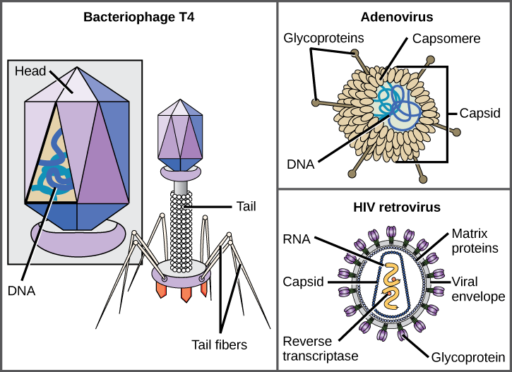


    def some(code):
        x = 21
        y = []


The coronavirus outbreak has been a trying time. I'm obviously not an epidemiologist, or a virologist, or any other profession that might be considered useful during the weeks to come. I don't have advice to offer, or words of wisdom to follow. In an ongoing class at Caltech, called _Physical Biology of the Cell_, we were asked to consider the information storage capacity of different viruses -- a topic that I've decided to expand upon here. 

The question that I am asking is: **"What is the information storage capacity, in terms of bits / volume, of different viruses? How does this compare to traditional storage mediums, e.g. CDs and hard drives?"**

Fortunately, tackling this problem is not too difficult, because much of the data on viral genome sizes and dimensions is already known. In answering this question, I relied heavily upon the book _Cell Biology by the Numbers_, especially a section called ["How Big are Viruses?"](http://book.bionumbers.org/how-big-are-viruses/). This dataset provides the capsid architecture (icosahedral, roughly spherical, etc.) for different viruses, along with their genome size and genome type (single-stranded RNA, double-stranded DNA, etc.). We can use the given diameters to calculate the size of the "heads" on these viruses. In this problem, I will approximate _all_ of the viruses as roughly spherical, thus using the formula for the volume of a sphere,

$V_{sphere} = \frac{4}{3} \pi r^3$

and using the diameters provided in _Cell Biology by the Numbers_ to calculate each viral volume.

{:class="img-responsive"}

_Different viruses store their "genome" within an icosahedron, such as that seen for the bacteriophage (left) or store their genome within a roughly spherical "shell". Either way, I approximate all of these viral containers as spheres. [Image from Wikimedia, CNX OpenStax](https://commons.wikimedia.org/wiki/File:Figure_21_01_03.png)_

To calculate "bits per volume", we also need to know how much information each virus can store. DNA consists of four bases -- adenine, cytosine, guanine and thymine -- and each base can encode two bits of information. For example, A could encode 00, T encodes 11, C encodes 01, and G encodes 10. So to calculate the bits per virus, we simply take its genome size and multiply by two.

{:class="img-responsive"}
_DNA is a polymer consisting of four different molecules (or bases): adenine, thymine, cytosine and guanine. These four molecules link and bind to one another, and each base can encode two bits of information. [Image by Madeleine Price Ball](https://commons.wikimedia.org/wiki/File:DNA_chemical_structure.svg)_

I used Python to analyze each virus and compute their volumes and kilobytes. There are 8000 bits in a kilobyte. This data is presented in the simple graph below. Hover over a point to see additional information.



This data, in itself, is not super interesting. Some of the viruses have a higher storage capacity by volume (any points closest to the upper left corner of the graph). The more interesting question, really, is:

**What volume of viruses would be required to store all 25 million books in the Library of Congress?**

That's quite a question, and it warrants some analysis. How much information is actually stored in the Library of Congress? I have seen blog posts from the [Library of Congress](https://blogs.loc.gov/thesignal/2011/07/transferring-libraries-of-congress-of-data/) that refute the strangely circulated claim that the Library of Congress holds a mere 10TB of data (I'm not sure where that figure originated). If the Library of Congress holds 25 million books, and one assumes that each _scanned_ book contains about 8 megabytes of data, then there should be approximately 200 million megabytes, or about 200 terabytes, of information in the Library of Congress. 200 TB is 2e+11 kilobytes of data.

To calculate the number of viruses needed to store that vast amount of information, simply divide 200 terabytes by the information storage capacity of different viruses. To compute the volume of viruses needed to store 200 terabytes, we can use our previous calculations, using the information storage capacities of different viruses in terms of their volume ($\mu m^3$).

My calculations for this second question are shown in the figure below which, again, is interactive.



Obviously, a major limitation with DNA storage is not in how information is stored (DNA is super stable) but, rather, in how the data is retrieved.

Now, how many viruses do we need to store the entire Library of Congress? 

Now, the logical question is: What size volume of viruses do we need to store the entire Library of Congress? The calculation is simple...

The next part of this analysis is based on the notion of [areal density](https://en.wikipedia.org/wiki/Areal_density_(computer_storage)).

The [Stanford study](https://news.stanford.edu/news/2009/january28/small-012809.html) and [Columbia Study](https://science.sciencemag.org/content/355/6328/950) can be read by clicking on the names.

To compute the areal density of DNA from the Columbia study, I simply converted their reported value of "215 petabytes per gram of DNA" into "215 petabytes per X bases of DNA" by using the molar mass of a typical DNA base pair. To compute the area of these DNA bases, I used base pair dimension values from [BioNumbers](https://bionumbers.hms.harvard.edu/bionumber.aspx?&id=103777). I obtained a final calculated areal density of $1.85 \times 10^{12}$ $\frac{bits}{in^{2}}$



"Interact with these graphs by zooming in, out. Hover over points to see more information."

Add a standard link to GitHub and Medium / etc

